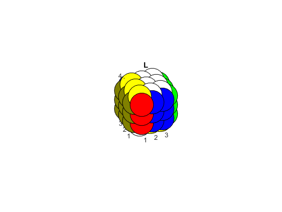
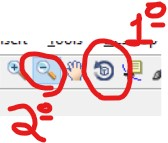

# Rubik-Commutator

Simulation algorithm of movements in the rubik's cube. Basis for the study of switches and graphs.




## Run

```
>>Cubo
mov: 'reset'
```
Letters to rotate: `'F'` to front, `'B'` to back, `'U'` to up, `'D'` to down, `'L'` to left, `'R'` to right, and `'reset'` to reset.
Uppercase to clockwise rotation and lowercase to counter-clockwise.

To better visualization, is recommended to rotate the Figure and decrease de zoom.

